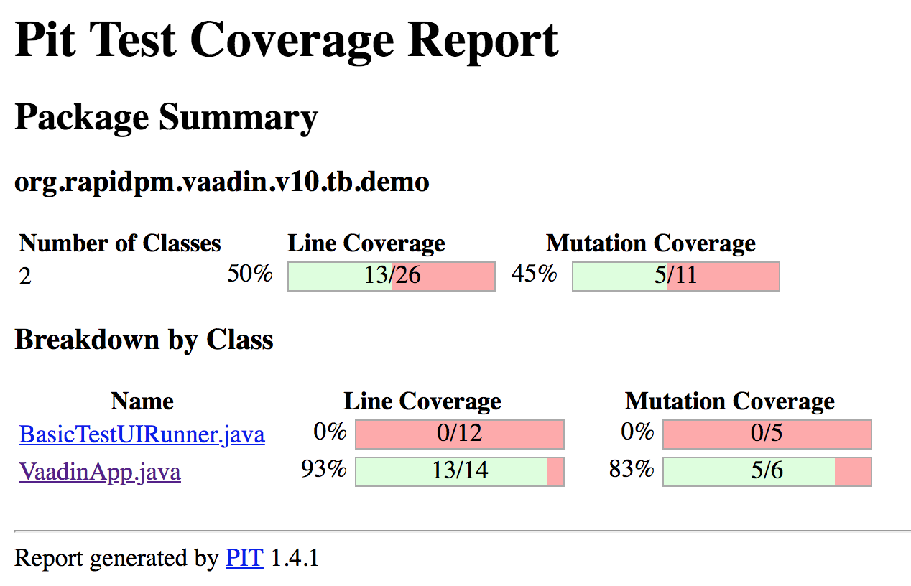

<center>
<a href="https://vaadin.com">
 </a>
</center>

# Nano Vaadin - Ramp up in a second.
A nano project to start a Vaadin project. Perfect for Micro-UIs packed as fat jar in a docker image.

## Supported JDK
This example is running from JDK8 ONLY!

## target of this project
The target of this project is a minimal rampup time for a first hello world.
Why we need one more HelloWorld? Well, the answer is quite easy. 
If you have to try something out, or you want to make a small POC to present something,
there is no time and budget to create a demo project.
You don´t want to copy paste all small things together.
Here you will get a Nano-Project that will give you all in a second.

Clone the repo and start editing the class ```BasicTestUI``` or ```BasicTestUIRunner```.
Nothing more. 

## How does it work?
This project will not use any additional maven plugin or technology.
Core Kotlin and the Vaadin Dependencies are all that you need to put 
a Vaadin app into a Servlet-container.

Here we are using the plain **meecrowave** as Servlet-Container.
[http://openwebbeans.apache.org/meecrowave/index.html](http://openwebbeans.apache.org/meecrowave/index.html)


As mentioned before, there is not additional technology involved.
No DI to wire all things together. 

But let´s start from the beginning.

## Start the Servlet-Container (Java)
The class ```BasicTestUIRunner``` will ramp up the Container.

Here all the basic stuff is done. The start will init. a ServletContainer at port **8080**.
If you want to use a random port, use ```randomHttpPort()``` instead of ```setHttpPort(8080);```
The WebApp will deployed as **ROOT.war**. 

```java
public class BasicTestUIRunner {
  private BasicTestUIRunner() {
  }

  public static void main(String[] args) {
    new Meecrowave(new Meecrowave.Builder() {
      {
//        randomHttpPort();
        setHttpPort(8080);
        setTomcatScanning(true);
        setTomcatAutoSetup(false);
        setHttp2(true);
      }
    })
        .bake()
        .await();
  }
}
```

After this you can start the app invoking the main-method.

## The UI itself
The UI itself is quite easy. 
There is only a button you can click.
For every click, the counter will be increased.

```java
@Route("")
public class VaadinApp extends Composite<Div> implements HasLogger {

  // read http://vaadin.com/testing for more infos
  public static final String BTN_CLICK_ME   = buttonID().apply(VaadinApp.class, "btn-click-me");
  public static final String LB_CLICK_COUNT = spanID().apply(VaadinApp.class, "lb-click-count");

  private final Button         btnClickMe   = new Button("click me");
  private final Span           lbClickCount = new Span("0");
  private final VerticalLayout layout       = new VerticalLayout(btnClickMe, lbClickCount);

  private int clickcount = 0;

  public VaadinApp() {
    btnClickMe.setId(BTN_CLICK_ME);
    btnClickMe.addClickListener(event -> lbClickCount.setText(valueOf(++clickcount)));

    lbClickCount.setId(LB_CLICK_COUNT);

    //set the main Component
    logger().info("setting now the main ui content..");
    getContent().add(layout);

  }
}
```


## Java, Vaadin and TDD
For testing the Vaadin app, the Open Source project Testbench-NG is used.
This is a jUnit5 / Webdriver - manager AddOn for the Selenium and Testbench projects.
To read more about it, plase have a look at 

[https://github.com/vaadin-developer/vaadin-testbench-ng](https://github.com/vaadin-developer/vaadin-testbench-ng)
The lates version of Testbench NG is : 

[](https://maven-badges.herokuapp.com/maven-central/org.rapidpm/rapidpm-vaadin-testbench-ng)
 

The next step is to create a PageObject for the UI.
This can be done straight forward.

```java
public class VaadinAppPageObject extends AbstractVaadinPageObject {


  public VaadinAppPageObject(WebDriver webdriver, ContainerInfo containerInfo) {
    super(webdriver, containerInfo);
  }

  public ButtonElement btnClickMe() {
    return btn().id(BTN_CLICK_ME);
  }

  public SpanElement lbClickCount() {
    return span().id(LB_CLICK_COUNT);
  }

  public void click() {
    btnClickMe().click();
  }

  public String clickCountAsString() {
    return lbClickCount().getText();
  }

  // no exception handling
  public int clickCount() {
    return valueOf(clickCountAsString());
  }

}
```

Now we can start writing logical tests. One could be 

```java
@VaadinWebUnitTest
public class VaadinAppTest {

  @Test
  @DisplayName("Hello World - Click twice")
  //@Disabled("classloader challenges with Atmosphere")
  void test001(VaadinAppPageObject pageObject) {
    pageObject.loadPage();
    assertEquals(0, pageObject.clickCount());
    pageObject.click();
    assertEquals(1, pageObject.clickCount());
  }
}
```

## Mutation Testing
This project will give you the basic config for MutationTesting as well.
Invoke the maven target **pitest:mutationCoverage** to create the report. 
The report itself will be under **target/pit-reports**




Happy Coding.

if you have any questions: ping me on Twitter [https://twitter.com/SvenRuppert](https://twitter.com/SvenRuppert)
or via mail.
